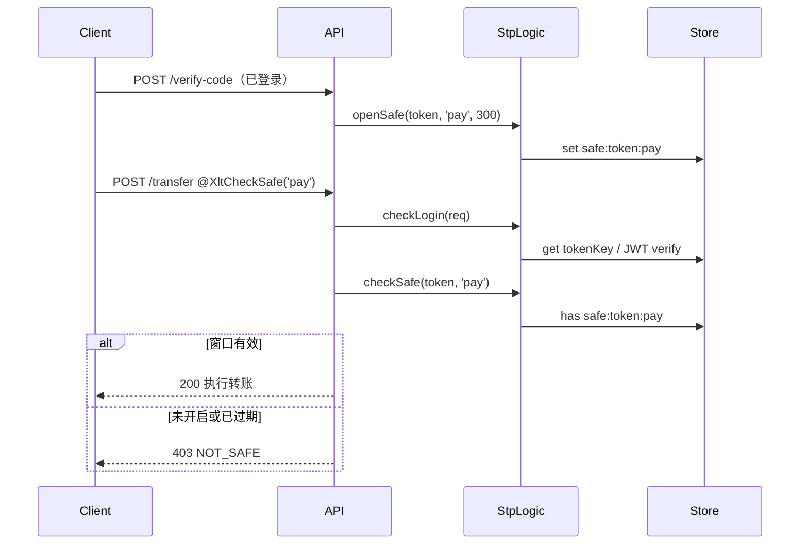

# 15 · 二级认证与临时 Token

1.1.0 新增**二级认证（Safe）**与**临时 Token**，用于支付确认、敏感操作、邮件链接等「先验证、再执行」的场景。

## 二级认证（Safe）

### 是什么

用户在已通过一级登录（token 有效）后，还需完成额外验证（短信、支付密码、人脸等），才能在**有限时间窗口**内执行敏感操作。

xlt-token 不实现具体验证逻辑，只提供：

- `openSafe` — 验证通过后「打开安全窗口」
- `checkSafe` — 检查窗口是否仍有效
- `closeSafe` — 主动关闭窗口
- `@XltCheckSafe` — 在 Guard 层自动调用 `checkSafe`

### 存储键

```
${tokenName}:safe:${token}:${business}  →  String(Date.now())
```

- `token`：当前用户 JWT / UUID token（完整字符串）
- `business`：业务标识，如 `'pay'`、`'deleteAccount'`
- 值为打开时间戳；**是否存在**即代表窗口有效（TTL 由 `openSafe` 的 `timeout` 控制）

### API

```ts twoslash
// 打开安全窗口（验证通过后调用）
openSafe(token: string, business: string, timeout: number): Promise<void>

// 检查是否有效，无效抛 NotSafeException（403）
checkSafe(token: string, business: string): Promise<void>

// 主动关闭（如敏感操作完成后）
closeSafe(token: string, business: string): Promise<void>
```

### 流程图



### `@XltCheckSafe(business)`

装饰在 Controller 方法或类上，由 `XltTokenGuard` 在 `checkLogin` 成功后自动调用 `checkSafe`：

```ts twoslash
import { XltCheckSafe, LoginId, TokenValue, StpUtil } from 'xlt-token';

@Controller('payment')
export class PaymentController {
  /** Step 1：验证码通过后打开安全窗口 */
  @Post('verify-code')
  async verifyCode(@TokenValue() token: string) {
    // ... 校验短信 / 支付密码 ...
    await StpUtil.openSafe(token, 'pay', 300);  // 300 秒有效
    return { ok: true };
  }

  /** Step 2：需要二级认证的操作 */
  @XltCheckSafe('pay')
  @Post('transfer')
  async transfer(@LoginId() loginId: string, @Body() dto: TransferDto) {
    // 能进到这里说明 checkSafe 已通过
    return { ok: true };
  }
}
```

> **注意**：`StpUtil` 当前尚未封装 `openSafe` / `checkSafe` / `closeSafe`，上例需在 Service 中注入 `StpLogic`，或自行扩展 `StpUtil`。

### 异常

未通过二级认证时抛出 `NotSafeException`（HTTP **403**）：

```json
{
  "statusCode": 403,
  "message": "二级认证未开启：pay"
}
```

附加属性：`business: string`，便于前端区分业务。

### 不同 business 互不影响

```ts twoslash
await stp.openSafe(token, 'pay', 300);
await stp.checkSafe(token, 'pay');           // ✅
await stp.checkSafe(token, 'deleteAccount'); // ❌ 403
```

## 临时 Token

### 是什么

短效、与登录态无关的一次性（或有限次）凭证，常用于：

- 邮件重置密码链接
- 邀请注册链接
- 导出文件下载链接

### 存储键

```
${tokenName}:temp-token:${tempToken}  →  业务值（任意字符串）
```

`tempToken` 由内置 `TokenStrategy.createToken('__temp__', config)` 生成（UUID / random-32 等），**不携带业务语义**。

### API

```ts twoslash
// 创建临时 token，关联业务数据
createTempToken(value: string, timeout: number): Promise<string>

// 读取（不自动删除）
parseTempToken(tempToken: string): Promise<string | null>

// 销毁（一次性消费后调用）
deleteTempToken(tempToken: string): Promise<void>
```

### 典型场景：邮件重置密码

```ts twoslash
// ── 发送邮件时 ──
const tempToken = await stp.createTempToken(`resetPwd:${userId}`, 1800); // 30 分钟
const link = `https://app.com/reset?t=${tempToken}`;
await emailService.send(user.email, link);

// ── 用户点击链接 ──
const value = await stp.parseTempToken(tempToken);
if (!value) throw new BadRequestException('链接无效或已过期');

const [, userId] = value.split(':');
await stp.deleteTempToken(tempToken);  // 一次性消费
await userService.resetPassword(userId, newPassword);
```

### 与登录 token 的区别

| | 登录 token | 临时 token |
| --- | --- | --- |
| 用途 | 标识已登录用户 | 承载单次业务数据 |
| 校验 | `checkLogin` / Guard | 自行 `parseTempToken` |
| 键前缀 | `login:token:` | `temp-token:` |
| 是否需要 loginId | 是 | 否 |

## 方法一览

| 方法 | 说明 |
| --- | --- |
| `openSafe(token, business, timeout)` | 打开二级认证窗口 |
| `checkSafe(token, business)` | 校验窗口，失败抛 403 |
| `closeSafe(token, business)` | 关闭窗口 |
| `createTempToken(value, timeout)` | 创建临时 token |
| `parseTempToken(tempToken)` | 读取关联值 |
| `deleteTempToken(tempToken)` | 销毁临时 token |

## 下一步

- Guard 与装饰器总览 → [05-guards-and-decorators](./05-guards-and-decorators.md)
- 异常处理（含 403） → [08-exceptions](./08-exceptions.md)
- JWT 模式下 safe 键仍使用完整 token 字符串 → [16-jwt-strategy](./16-jwt-strategy.md)
