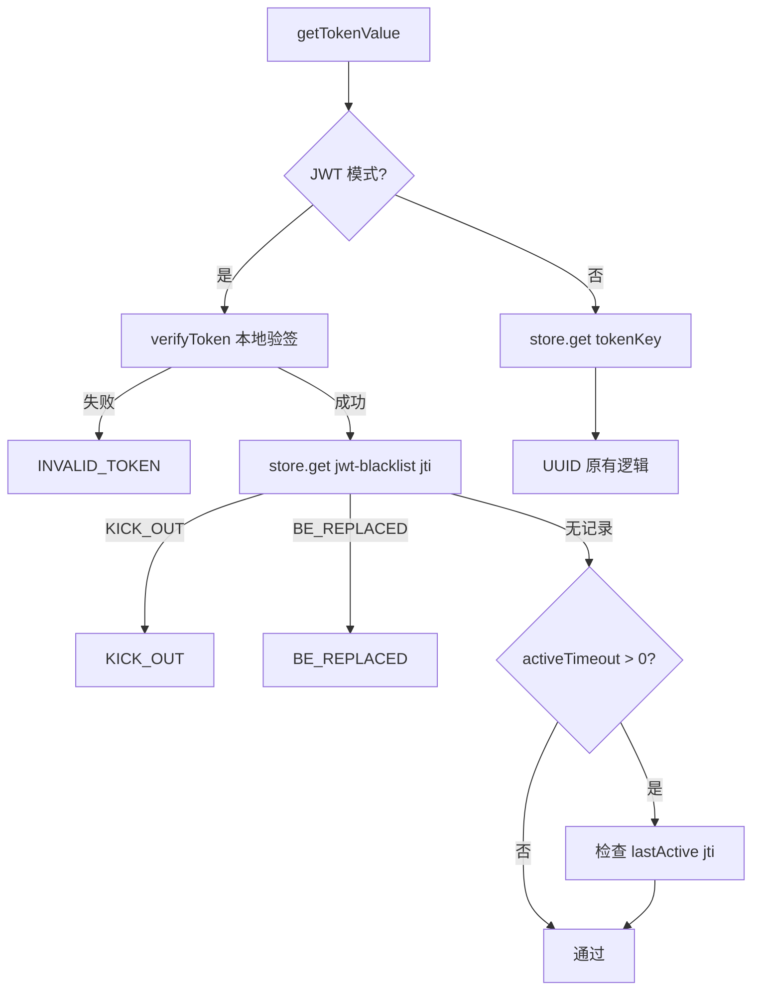

# 16 · JWT 策略

> 包：内置 `JwtStrategy` 在 `@xlt-token/nestjs`；鉴权逻辑在 `@xlt-token/core`。

1.1.0 内置 `JwtStrategy`，在保留 xlt-token **踢人、顶号、活跃过期**等状态语义的前提下，用 JWT 承载 `loginId`，并通过 **jti 黑名单** 实现服务端可控的会话失效。

## UUID 模式 vs JWT 模式

| 维度 | UUID 模式（默认） | JWT 模式 |
| --- | --- | --- |
| Token 生成 | `UuidStrategy`，随机字符串 | `JwtStrategy`，`jsonwebtoken` 签发 |
| 鉴权主路径 | `store.get(tokenKey)` → loginId | 本地 `verifyToken` → sub + jti |
| 每次请求 Store IO | **1 次**（查 tokenKey） | **0~1 次**（仅查黑名单；正常 token 无黑名单记录） |
| 踢人 / 顶号 | 改 `tokenKey` 值为 `KICK_OUT` / `BE_REPLACED` | 写 `jwt-blacklist:${jti}` |
| sessionKey 存储 | 完整 token | **jti**（节省空间） |
| activeTimeout key | `lastActive:${token}` | `lastActive:${jti}` |
| 依赖 | 无额外 peer dep | 需安装 `jsonwebtoken` |

> **设计定位**：xlt-token 的 JWT 模式是「**有状态 JWT**」——JWT 负责携带身份，Store 负责踢人、顶号、多端索引。若你需要纯无状态 JWT（服务端零存储），xlt-token 并非合适方案。

## 安装依赖

`jsonwebtoken` 为 **optional peer dependency**，使用 JWT 时需自行安装：

```bash
pnpm add jsonwebtoken
pnpm add -D @types/jsonwebtoken   # TypeScript 项目
```

## 配置示例

```ts twoslash
import { Module } from '@nestjs/common';
import { XltTokenModule, JwtStrategy } from '@xlt-token/nestjs';

@Module({
  imports: [
    XltTokenModule.forRoot({
      isGlobal: true,
      strategy: { useClass: JwtStrategy },
      config: {
        tokenName: 'authorization',
        timeout: 86400,              // JWT expiresIn + 会话 TTL
        isConcurrent: false,         // 同 device 顶号（按需）
        isShare: false,
        jwt: {
          secret: process.env.JWT_SECRET!,
          algorithm: 'HS256',        // 默认 HS256
          issuer: 'xlt-token',       // 可选
          audience: 'my-app',        // 可选
        },
      },
    }),
  ],
})
export class AppModule {}
```

### `JwtConfig` 字段

| 字段 | 类型 | 说明 |
| --- | --- | --- |
| `secret` | `string` | **必填**，签名密钥 |
| `algorithm` | `HS256` / `HS384` / … | 默认 `HS256` |
| `issuer` | `string` | 可选，写入 JWT `iss` |
| `audience` | `string` | 可选，写入 JWT `aud` |

## JWT Payload 约定

`createToken` 签发的 payload：

```json
{
  "sub": "1001",
  "jti": "550e8400-e29b-41d4-a716-446655440000"
}
```

- `sub` → loginId
- `jti` → 唯一会话 ID，用于黑名单与 `activeTimeout`

## 鉴权流程



### 与 UUID 模式的 IO 对比

**正常请求（未被踢）**：

- UUID：`GET tokenKey` × 1
- JWT：`GET jwt-blacklist:${jti}` × 1（通常 miss）；若从未踢过，键不存在即通过

被踢 / 被顶后，JWT 模式黑名单命中，返回对应 `NotLoginType`。

## 黑名单机制

| 键 | 值 | 写入时机 |
| --- | --- | --- |
| `${tokenName}:jwt-blacklist:${jti}` | `KICK_OUT` 或 `BE_REPLACED` | `kickout` / `kickoutByToken` / 顶号 / `deviceConcurrent=false` 全端互踢 |

TTL 与 `config.timeout` 一致（踢人时写入）。

**为什么用 jti 而不是完整 JWT？**

- JWT 字符串很长，不适合作为 Redis key
- 同一 JWT 的 `jti` 唯一标识一次登录会话
- 黑名单只存「被主动失效」的会话，正常在线用户无额外 key

## 登录时的 Store 写入

JWT 模式下 **`tokenKey` 不再写入**（loginId 由 JWT `sub` 携带）：

```
session:${loginId}:${device}  →  jti
session-list:${loginId}       →  [{ device, token: 完整JWT, loginTime }]
lastActive:${jti}             →  Date.now()  （activeTimeout > 0 时）
```

## 踢人 / 顶号

```ts twoslash
// kickout — 写黑名单（非改 tokenKey）
await stp.kickout('1001');              // 默认 device
await stp.kickout('1001', 'app');       // 指定 device

// 按 token 踢
await stp.kickoutByToken(jwtToken);
```

被踢用户下次请求：`verifyToken` 通过 → 黑名单命中 → `NotLoginException(KICK_OUT)`。

## activeTimeout

与 UUID 模式语义相同，但 `lastActive` 键使用 **jti**：

```
lastActive:${jti}  →  最后活跃时间戳
```

每次鉴权通过后刷新；超时返回 `TOKEN_TIMEOUT`。

## 内置 `JwtStrategy` API

```ts twoslash
class JwtStrategy implements TokenStrategy {
  createToken(loginId: string, config: XltTokenConfig): string;
  generateToken(payload: any): string;   // 自由签发
  verifyToken(token: string): JwtPayload & { sub: string; jti: string };
}
```

也可参考 [Token 策略](/core/token-strategy) 自定义 JWT 策略，只要实现 `verifyToken` 且配置 `jwt.secret`，`StpLogic` 会自动进入 JWT 分支。

## 限制与已知差异

| 项 | 说明 |
| --- | --- |
| `renewTimeout` | JWT 模式无 `tokenKey`，当前 `renewTimeout` 返回 `null`；续期需重新 `login` 或自行扩展 |
| `logout` | 仍按 UUID 路径查 `tokenKey`，JWT 模式 logout 需后续版本完善 |
| `safe` / 临时 token | 仍使用**完整 token 字符串**作为键的一部分，与 JWT 兼容 |
| 自定义 payload | 业务 claims 请用 `generateToken`，登录入口仍走 `createToken(sub, jti)` |

## 完整示例

```ts twoslash
import { Body, Controller, Get, Post } from '@nestjs/common';
import { StpLogic, LoginId } from '@xlt-token/nestjs';

@Controller('auth')
export class AuthController {
  constructor(private readonly stp: StpLogic) {}

  @Post('login')
  async login(@Body('userId') userId: string) {
    const token = await this.stp.login(userId, { device: 'app' });
    return { token };
  }

  @Get('me')
  me(@LoginId() loginId: string) {
    return { loginId };
  }
}
```

客户端请求：

```http
GET /me
Authorization: eyJhbGciOiJIUzI1NiIs...
```

## 下一步

- Token 策略接口说明 → [Token 策略](/core/token-strategy)
- 多端 + JWT 踢设备 → [多端登录](/core/multi-device)
- NotLoginType 与前端处理 → [异常处理](/core/exceptions)
